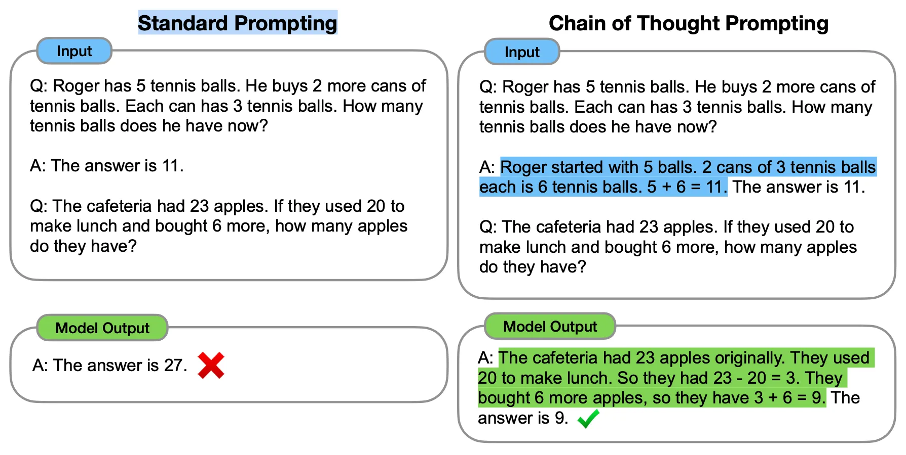

# LLM prompt Engineering

## Product Extraction API Documentation


Welcome to the Product Extraction API! This API leverages Large Language Models (LLMs) for advanced field extraction from product descriptions. The API is built using Flask to handle HTTP requests and is designed to work with state-of-the-art LLMs like LLaMA and a custom model, CameLLM.


### Introduction


The Product Extraction API is centered around utilizing LLMs to extract specific fields from product descriptions. This README will guide you through the setup and provide an overview of how prompt engineering and LLMs are employed to enhance the model's ability to parse and extract relevant information from text.


### Core Features and Focus


Our API integrates the latest advancements in prompt engineering and Chain of Thought (CoT) techniques to improve LLM comprehension and extraction accuracy. By carefully designing prompts, the API maximizes the effectiveness of LLaMA and CameLLM in extracting attributes like length, weight, color, etc., from complex product descriptions.


#### Chain of Thought Prompting


Chain of Thought prompting is a technique that guides the LLM step-by-step through reasoning, enhancing its ability to arrive at the correct answer. This method is particularly effective in scenarios where the LLM needs to perform calculations or follow logical steps to derive the correct information.





*The image above illustrates how Chain of Thought prompting aids in breaking down the problem into manageable steps, improving model accuracy.*


### Getting Started


#### Installation Instructions


1. **Install Docker:**
   Ensure Docker is installed on your system. Docker is used for containerization, simplifying deployment and dependencies.
   - [Docker Installation Guide](https://docs.docker.com/get-docker/)


2. **Clone the Repository:**
   ```bash
   git clone https://github.com/kosarkazemi/Product-Extra.git
   cd Product-Extra
   ```


3. **Install Poetry:**
   Poetry is used for dependency management and environment setup.
   - [Poetry Installation Guide](https://python-poetry.org/docs/)


4. **Install Dependencies:**
   ```bash
   poetry install
   ```


5. **Build and Run the Docker Image:**
   ```bash
   docker build -t product_extraction_api .
   docker run -p 5001:5000 product_extraction_api
   ```
   The API will be accessible at `http://0.0.0.0:5001`.


### API Endpoints Overview


While the focus of this project is on LLM and prompt engineering, the API exposes several endpoints to interact with the models:


1. **`GET /`**: Returns a welcome message.
2. **`POST /extract_fields`**: Extracts specified fields from products using the selected LLM.


For a detailed guide on API usage and interaction, refer to the provided examples or use a tool like Postman.


### Usage and Examples


- **Access the API:** You can use tools like Postman or programmatically send HTTP requests to the API endpoints.
- **Run the client.py Script:** This script demonstrates how to send a POST request to the API and receive extracted fields.


### Advanced Prompt Engineering Techniques


In this project, LLMs are prompted with specific templates that include a system prompt and user messages, optimized to adhere to the character length constraints for each model:
- **LLaMA prompt:** max 4096 characters
- **CameLLM prompt:** max 2048 characters


These prompts are designed to enhance the model's extraction capabilities by providing clear, concise instructions and examples that guide the model's output.


### Next Steps


1. **Diverse Examples for Better Understanding:**
   Provide varied examples to improve the model's comprehension across different product domains.


2. **Tailored Prompts for Each Product Aspect:**
   Develop specific prompts for different product attributes to refine field extraction further.


